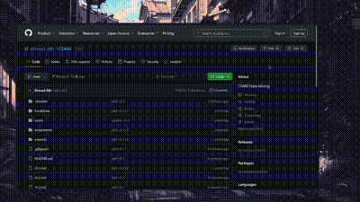

# Data Mining Cheatsheet
## Table of Content
read [this](#Installation) section first
- [Chapter 1](ch.1.md)
- [Chapter 2](ch.2.md)
- [Chapter 3](ch.3.md)

---
## Installation
> [!IMPORTANT]
> I haven't covered exactly all material here due to my limited time, however feel free to contribute to it if something is missing.

> [!WARNING]
> I've made this Cheat sheet assuming the reader will be viewing it via [Obsidian.md](https://obsidian.md)  , if you're using the Web, some formulas won't be rendered as intended.

To install through your desktop:
1. install [Obsidian.md](https://obsidian.md) on your system, then follow with the other steps.
2. :

 

