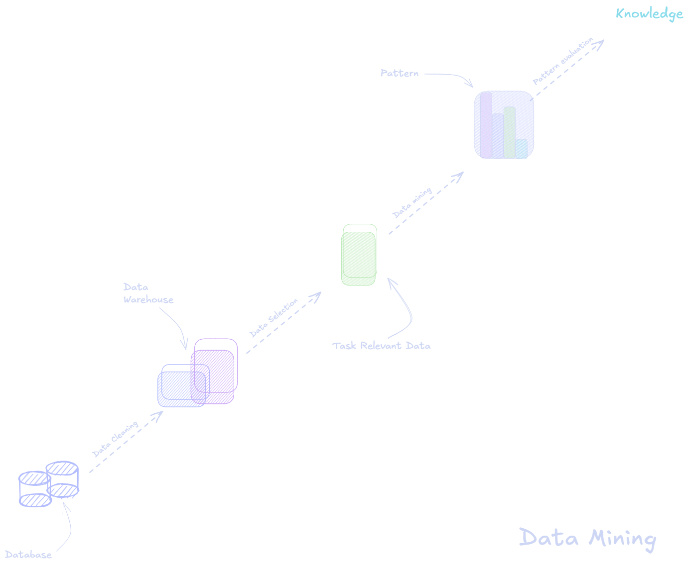

### Data Mining Cheat Sheet: Chapter 1 - Introduction

#### What is Data Mining?

- **Definition**: Discovering patterns, models, and knowledge in large datasets.
    - Other names: Knowledge Discovery from Data (KDD), pattern discovery, data analytics.
- **Example**: Google's Flu Trends predicted flu activity using search data.

#### Why Do We Need Data Mining?

- **Huge Data Volume**: Generated by databases, data warehouses, and streams (e.g., sensors, WWW).
- **Challenges**: Humans cannot comprehend this data without advanced tools.
- **Key Insight**: We are _data-rich_ but _information-poor_.

#### What is (Not) Data Mining?

- **Not Data Mining**:
    - Simple search queries.
    - Looking up a phone number in a directory.
- **Data Mining Tasks**:
    - Detecting popular surnames by location.
    - Market basket analysis (e.g., finding items bought together).

#### Tasks in Data Mining

- **Predictive**: Predict unknown values (e.g., future stock prices).
- **Descriptive**: Discover human-interpretable patterns (e.g., clustering customers).

#### Knowledge Discovery Process (KDD)

1. **Pre-Processing**: Data cleaning, integration, normalization.
2. **Data Mining**: Identify patterns (e.g., classification, clustering).
3. **Post-Processing**: Evaluate and visualize patterns.

#### Diversity of Data Types

- **Structured**: Databases, data cubes.
- **Semi-structured**: Weblogs, graphs, sequences.
- **Unstructured**: Text, multimedia (e.g., images, videos).
- **Applications**:
    - Sequence data (shopping, bio-sequences).
    - Time-series data (financial data).
    - Spatial and multimedia data (maps, videos).

---

#### Quick Overview of Tasks

| **Task**              | **Description**                                      | **Example**                                     |
| --------------------- | ---------------------------------------------------- | ----------------------------------------------- |
| **Classification**    | Assign labels to data.                               | Spam detection, text categorization.            |
| **Clustering**        | Group similar data points.                           | Customer segmentation in marketing.             |
| **Association Rules** | Find item dependencies in datasets.                  | Bread → Peanut Butter (Market Basket Analysis). |
| **Regression**        | Predict continuous values.                           | Sales prediction, stock market trends.          |
| **Anomaly Detection** | Identify data points deviating from normal patterns. | Fraud detection, rare event analysis.           |

---

