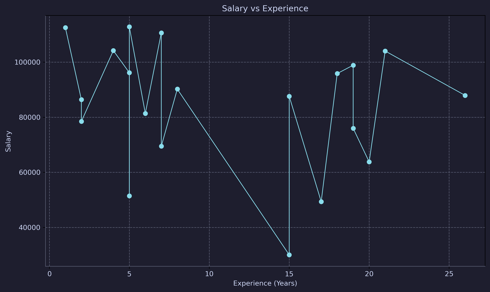
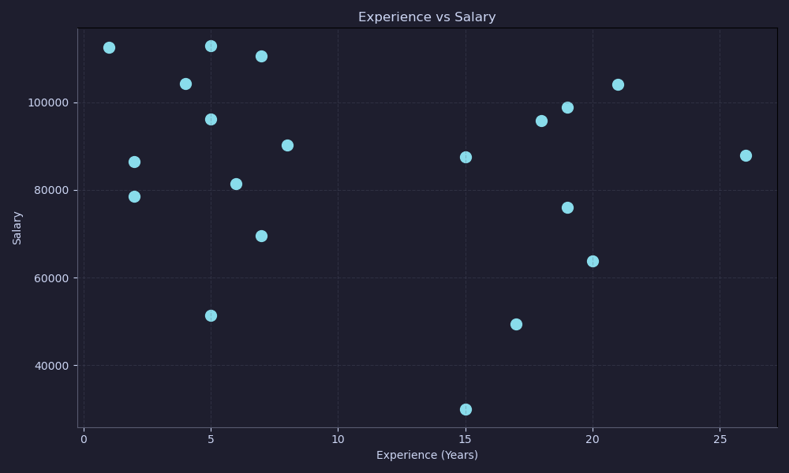
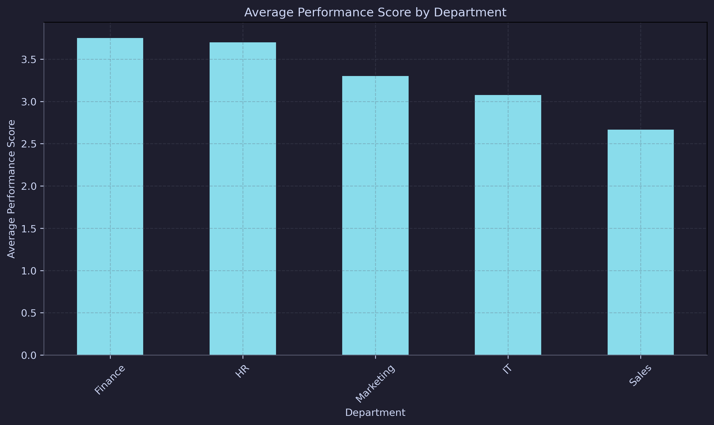
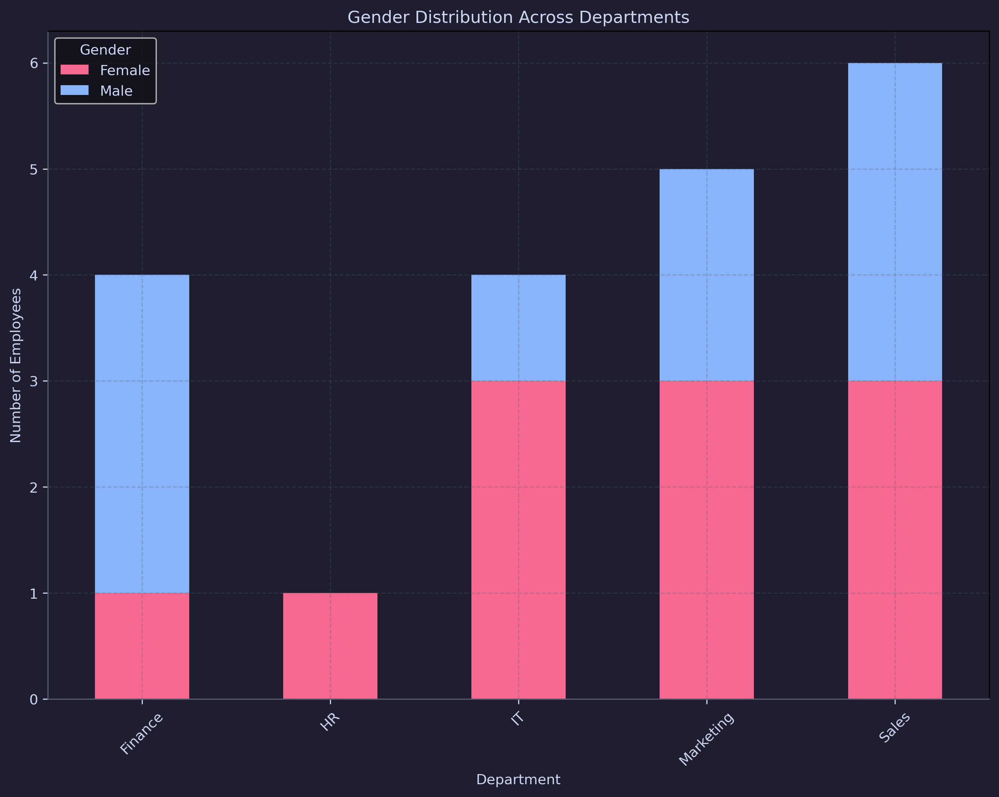
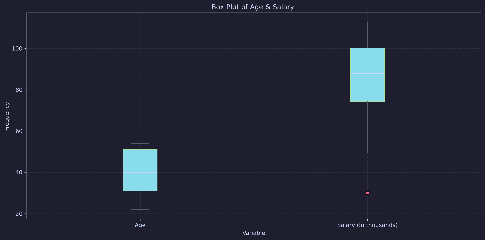
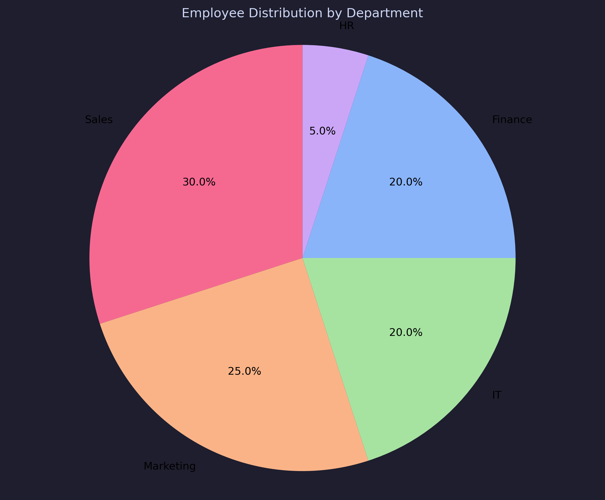

### Exploratory Data Analysis Cheat Sheet: Chapter 2

#### Introduction to Python for Data Science

- **Why Python?**
    - Simple, versatile, and rich in libraries for data analysis.
    - Recommended: Use the **Anaconda distribution** for pre-installed libraries.

#### Essential Libraries

- **Pandas**: Data manipulation (e.g., `pd.read_csv()`, `pd.read_excel()`).
- **Matplotlib & Seaborn**: Data visualization.
- **Plotly**: Interactive plots via web-based visualizations.
---
#### Descriptive Statistics

- **Mean**: Average value.

- **Median**: Middle value (ordered dataset).
- **Mode**: Most frequent value(s).
- **Variance**: Dispersion of data around the mean. 

**Python Example**:

```python
exam_scores = data['Exam_Score']
print("Mean:", exam_scores.mean())
print("Median:", exam_scores.median())
print("Mode:", exam_scores.mode().iloc[0])
print("Variance:", exam_scores.var())
```

---

#### Correlation Analysis

- Measures the relationship between variables.
    - **Positive Correlation**: Variables increase together.
    - **Negative Correlation**: One increases while the other decreases.
    - **No Correlation**: No clear relationship.

**Python Example**:

```python
correlation_matrix = data.corr()
print(correlation_matrix) # Display correlation matrix
```

---

### Plots
#### Common Plots in Python

| **Plot Type**        | **Usage**                   |
| -------------------- | --------------------------- |
| **Line Plot**        | Trends over time.           |
| **Scatter Plot**     | Relationships between vars. |
| **Histogram**        | Frequency distribution.     |
| **Bar Plot**         | Compare categories.         |
| **Stacked Bar Plot** | Compare sub-categories.     |
| **Box Plot**         | Distribution & outliers.    |
| **Pie Chart**        | Proportional comparison.    |


#### Visual Representation

<details>
<summary>📈 Line Plot</summary>
<div align="center">

</div>
</details>
<details>
<summary>🔵 Scatter Plot</summary>
<div align="center">

</div>
</details>

<details>
<summary>📊 Bar Plot</summary>
<div align="center">

</div>
</details>

<details>
<summary>🔳 Stacked Bar Plot</summary>
<div align="center">

</div>
</details>

<details>
<summary>📦 Box Plot</summary>
<div align="center">

</div></details>

<details>
<summary>🥧 Pie Chart</summary>
<div align="center">

</div>
</details>

---

#### Plots Code Snippets
**Import Statements**
```python
import pandas as pd
import matplotlib.pyplot as plt 

data = pd.read_csv('data.csv') # Read data from CSV file, `read_excel()` for .xlsx files
```

**Line Plot**
```python
def plotLine():
    # sort data (necessary in some cases)
    line_data = data.sort_values('Experience (Years)')
    
    plt.plot(line_data['Experience (Years)'], line_data['Salary'],
             marker='o',
             linestyle='-')

    plt.title('Salary vs Experience')
    plt.xlabel('Experience (Years)') # Set X Axis label name
    plt.ylabel('Salary') # Set Y label name
    plt.grid(True)
    plt.tight_layout() # Stretch the Layout
    plt.show()
    plt.close()
```

**Pie Plot**
```python
def plotPie():
	# Count the frequency of Department Values
    dept_counts = data['Department'].value_counts() 
    
    plt.pie(dept_counts, labels=dept_counts.index, autopct='%1.1f%%',
            colors=['red', 'lightgreen', 'green', 'blue', 'skyblue']) 
    
    plt.title('Employee Distribution by Department')
    
    plt.axis('equal') # Equal Aspect Ratio so it displays as a Circle
    plt.show()
    plt.close()
```

**StackedBar Plot**
```python
def plotStackedBar():
    # 3. Stacked Bar Chart - Gender Distribution across Departments
    # Group by Gender & Department and count...
    gender_dept = data.groupby(['Gender', 'Department']).size().unstack()
    
    gender_dept.plot(kind='bar', stacked=True, color=[red, blue])  # Set bar colors

    plt.title('Gender Distribution Across Departments')
    plt.xlabel('Department')
    plt.ylabel('Number of Employees')

    plt.grid(axis='y') # axis=y --> A grid of horizontal lines only

    plt.tight_layout()
    plt.show()
```

**Bar Plot**
```python
def plotBar():
    # 4. Bar Chart - Average Performance Score by Department
    plt.figure(figsize=(10, 6)) # Figure Size
    plt.bar(data['Department'], data['Performance Score'], color='skyblue')
    
    plt.title('Average Performance Score by Department')
    plt.xlabel('Department')
    plt.ylabel('Average Performance Score')
    
    plt.xticks(rotation=45, ha='right') # rotate the Names on the X axis so they don't intersect
    plt.grid(axis='y')
    plt.tight_layout()
    plt.show()
```

**Box Plot**
```python
def plotBox():
    # Extracting data for box plot 
    exam_scores = data['Exam_Score']
    project_grades = data['Project_Grade']
    
    # Creating a box plot 
    plt.boxplot([exam_scores, project_grades], labels=['Exam Scores', 'Project Grades']) 
    
    # Adding labels and title 
    plt.xlabel('Variable') 
    plt.ylabel('Value') 
    plt.title('Box Plot of Exam Scores and Project Grades')  
    plt.grid(axis='y') 
    plt.show()
```

**Scatter Plot**
```python
def plotScatter():
    # 6. Scatter Plot - Experience vs Salary with Performance Score as color
    plt.figure(figsize=(10, 6))
    plt.scatter(data['Experience (Years)'], data['Salary'],
                          color='skyblue',
                          alpha=0.5 )
                          
    plt.title('Experience vs Salary')
    plt.xlabel('Experience (Years)')
    plt.ylabel('Salary')
    plt.grid(True)
    plt.tight_layout()
    plt.show()
```

