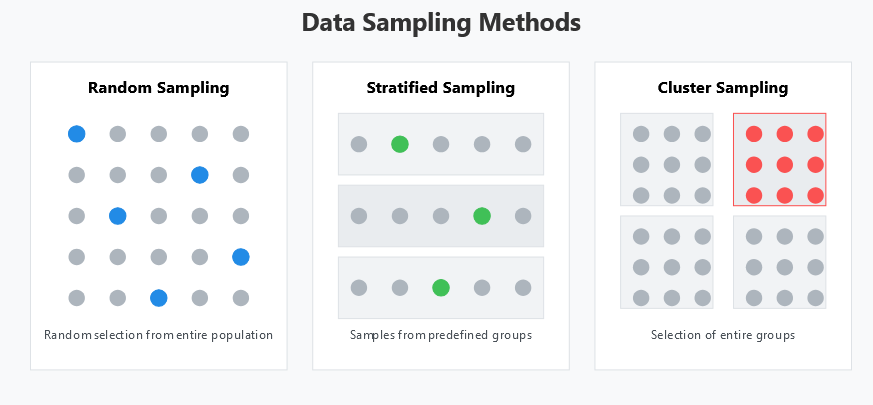
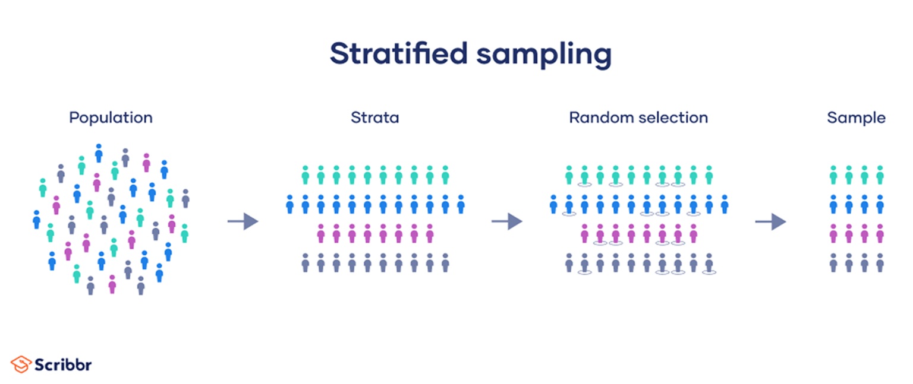

# Data Mining Cheatsheet: Sampling Methods 
> [!WARNING]
> This Page doesn't cover whole ch.5


## 1. Random Sampling
- **Definition**: Every member of the population has an equal chance of selection.
- **Steps**:
  1. Identify the population.
  2. Use a random method (e.g., `sample()` in Python) to select members.
- **Python Example**:
  ```python
  import pandas as pd
  data = pd.read_csv('dataset.csv')
  random_sample = data.sample(n=10, random_state=42)
  print(random_sample)
  ```
- **Use Cases**:
  - Best for unbiased population representation.
  - Quick and simple.

---

## 2. Stratified Sampling

- **Definition**: Divides population into subgroups (strata) and samples proportionally from each.
- **Steps**:
  1. Divide the population into strata based on a key variable.
  2. Use random sampling within each stratum.
- **Python Example**:
  ```python
  stratified_sample = data.groupby('Department').apply(
      lambda x: x.sample(frac=0.50)
  )
  print(stratified_sample)
  ```
- **Advantages**:
  - Ensures representation of all subgroups.
  - Precise estimates for subgroups.
- **Example**:
  - Subgroups: Departments (e.g., Engineering, Psychology).
  - Sampling fraction: 50% from each department.

---

## 3. Cluster Sampling
- **Definition**: Population is divided into clusters(groups), and a random sample of clusters (= a random group) is selected.
- **Steps**:
  1. Divide population into clusters (e.g., by location).
  2. Randomly select a subset of clusters.
  3. Study all members of selected clusters.
- **Python Example**:
  ```python
  import numpy as np
  clusters = np.array_split(data, 4)
  chosen_clusters = np.random.choice(len(clusters), 2, replace=False)
  sample = pd.concat([clusters[i] for i in chosen_clusters])
  print(sample)
  ```
- **Advantages**:
  - Cost-efficient for large populations.
  - Useful when data collection from the entire population is impractical.

---

## Key Points for Quiz
1. **Random Sampling**:
   - Ensures equal probability.
   - Doesn't guarantee subgroup representation.

2. **Stratified Sampling**:
   - Requires knowledge of strata.
   - Accurate subgroup analysis.

3. **Cluster Sampling**:
   - Relies on cluster representativeness.
   - May introduce bias if clusters vary significantly.

---

## Tips for Exam
- Practice coding examples for each sampling method.
- Understand when to use each method:
  - Random: General populations.
  - Stratified: Ensuring subgroup representation.
  - Cluster: Cost and practicality.

---

Happy studying! 🚀
